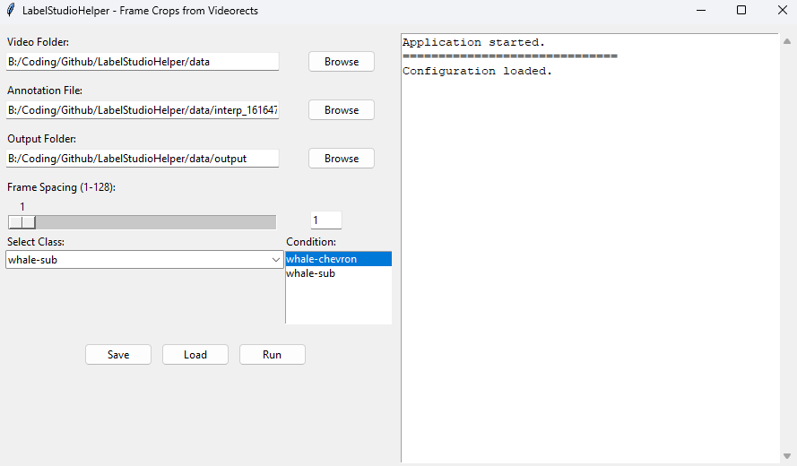

# Label Studio Helper

This is / will be a collection of python scripts to help with various tasks related to Label Studio.

## Video Box Cropper
> frame_crops_from_videorects.py

This script is used to crop boundig box rects out of videos.




# Usage
After exporting your VideoRectangle labels as a JSON file from Label Studio, you can use this script to crop bounding boxes out of the video.
- Supports normal and obb bounding boxes.
- Extracts only crops of the target class selected in the UI.
- You can select none, one or mulitple condtional classes
    - For each crop of the target class the script will check if each conditional class has an instance present within the bounding box of the target class.
- Expects the video labels to be interpolated already.
```xml
<View>
  <Video name="video" value="$video" framerate = "$fps" />
  <VideoRectangle name="box" toName="video"/>
  <Labels name="videoLabels" toName="video">
    <Label value="whale" background="#F759AB"/>
    <Label value="whale-chevron" background="#ADC6FF"/>
    <Label value="whale-marking" background="#9254DE"/>
  </Labels>
</View>
```

